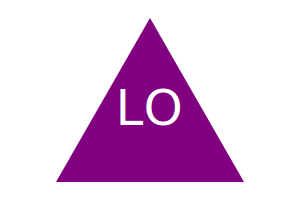

# 10 Object-oriented Programming: SVG Logo Maker

## Description

This is a command line application that uses Node.js and takes in user input to produce a simple 3-letter logo of unique color and shape that is an [SVG file](https://en.wikipedia.org/wiki/Scalable_Vector_Graphics). The app prompts the user to choose a color and shape, provide text for the logo, and save the generated SVG to a `.svg` file.

## Walkthrough Video
This is a command line application, therefore will not be deployed. Here is the [link]() to a walkthrough video that demonstrates its functionality and passes written jest tests. 

The walkthrough video demonstrates how a user would enter responses to all of the prompts in the application and invoke the application from the command line as well as how all tests are passed from the command line. It also shows the generated SVG file opened in the browser. The image in the browser should reflect the choices made by the user (text, shape, and colors).

## Sample Output

The following image is a sample SVG file generated by the app, given the following input entered by the user: `DEV` for the text, `white` for the text color, `square` from the list of shapes, and `purple` for the shape color. 



## Testing/Tools

This application uses [Jest](https://www.npmjs.com/package/jest) for running the unit tests and [Inquirer](https://www.npmjs.com/package/inquirer/v/8.2.4) for collecting user inputs. The application will be invoked by using the following command:

```bash
node index.js
```
The application can be tested by using the following command:

```bash
npm test
```

With the current written unit tests, each shape class will be tested for a `render()` method that successfully returns a string for the corresponding SVG file with the given shape color.


## Additional SVG Resources

* [Example SVG](https://static.fullstack-bootcamp.com/fullstack-ground/module-10/circle.svg)

* [Scalable Vector Graphics (SVG)](https://en.wikipedia.org/wiki/Scalable_Vector_Graphics)

* [SVG tutorial](https://developer.mozilla.org/en-US/docs/Web/SVG/Tutorial)

* [Basic SVG shapes](https://developer.mozilla.org/en-US/docs/Web/SVG/Tutorial/Basic_Shapes)

* [Text in SVG](https://developer.mozilla.org/en-US/docs/Web/SVG/Tutorial/Texts)

* [SVG VS Code extension](https://marketplace.visualstudio.com/items?itemName=jock.svg)


